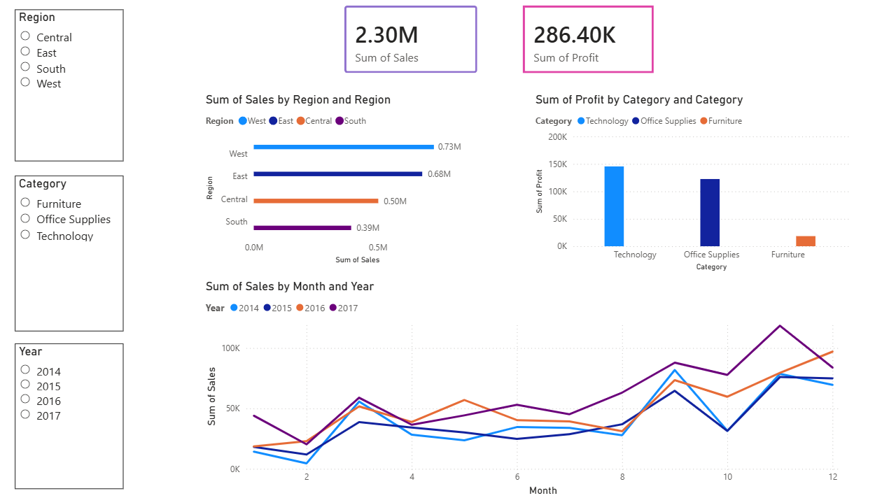
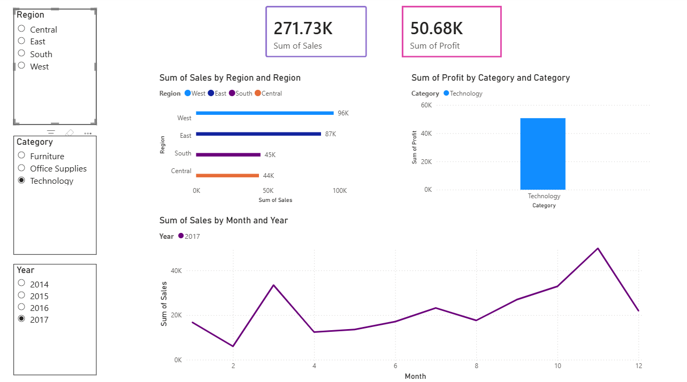

# powerbi-sales-eda
Exploratory Data Analysis and Power BI dashboard on retail sales data

## Project Overview
This project focuses on performing exploratory data analysis on a retail sales dataset and building an interactive Power BI dashboard to extract business insights.

## Tools & Technologies
- Python (pandas)
- Power BI
- Kaggle Notebooks
- CSV Data

## Key Tasks
- Cleaned and prepared raw sales data using Python.
- Performed exploratory data analysis to identify trends in sales and profit.
- Designed an interactive one-page Power BI dashboard with KPIs and filters.
- Visualized regional and category-level performance.

## Dashboard Preview

